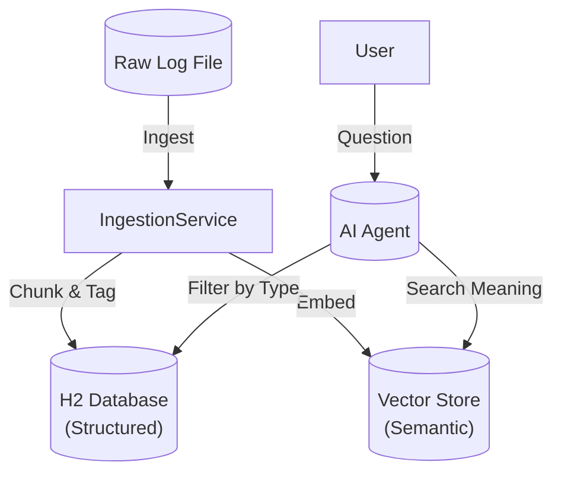

# AI-Powered Log Collector & Analysis Bot

A "Hybrid Search" Log Analysis tool designed for banking environments. It combines **Structured SQL Queries** (for precise filtering and counting) with **Semantic Vector Search** (for understanding error context), powered by an AI Agent (LangChain4j + OpenAI).

## 🚀 Features

*   **Advanced Log Ingestion**:
    *   **Timestamp Chunking**: Automatically groups multi-line stack traces (e.g., `java.lang.ArithmeticException`) into a single logical log entry.
    *   **Metadata Envelope**: Enriches logs with `log_type` (e.g., `Payment Post`, `Address Update`) and `source_file` for traceability.
    *   **Hybrid Storage**: Saves structured data to H2 (SQL) and semantic embeddings to a customized Vector Store.
*   **Intelligent Chat Interface**:
    *   **Natural Language Queries**: Ask "Find payment errors from yesterday" or "Why did the Late Fee calculation fail?".
    *   **Tool-Use**: The AI dynamically selects between SQL aggregation (warnings/counts) and Vector similarity search (root cause analysis).
*   **Modern Tech Stack**:
    *   **Backend**: Java 21, Spring Boot 4.0.1, LangChain4j, H2 Database.
    *   **Frontend**: React + TypeScript + Vite.

## 🏗️ Architecture

The system follows a Metadata Envelope pattern to ensure logs are traceable and searchable by business domain.



## 🛠️ Setup & Run

### Prerequisites
*   Java 21+
*   Docker (Optional, but recommended)
*   OpenAI API Key (Set in `application.properties` or env var)

### Option 1: Docker (Recommended - Full Stack)
Run the entire application (Backend + Frontend) in a single container.

1.  **Build**: `docker build -t log-bot .`
2.  **Run**: `docker run -p 9090:9090 -e OPENAI_API_KEY="sk-..." log-bot`
3.  **Access**: Open [http://localhost:9090](http://localhost:9090)

### Option 2: Manual Setup

#### Backend
1.  Navigate to the project root.
2.  Build and run the Spring Boot application:
    ```bash
    mvn clean package -DskipTests
    java -jar target/log-bot-0.0.1-SNAPSHOT.jar
    ```
    *The server runs on http://localhost:9090*

#### Frontend (Dev Mode)
1.  Navigate to the frontend directory:
    ```bash
    cd frontend
    ```
2.  Install dependencies and start the dev server:
    ```bash
    npm install
    npm run dev
    ```
    *The UI runs on http://localhost:5173*

## 📚 Usage Guide

1.  **Ingest Logs**: Click the "Ingest Logs" button on the UI. This processes the sample `banking_logs.log` file.
2.  **Ask Questions**:
    *   *"Give me a summary of Payment errors"* (Uses SQL Aggregation)
    *   *"Show me details for INT-CALC-FAIL"* (Retrieves full stack trace)
    *   *"Find errors in Address Update logs"* (Filters by Log Type)

## 📁 Project Structure

*   `src/main/java/com/google/logbot`
    *   `model/LogEntry.java`: Core entity with metadata fields (`logType`, `sourceFile`).
    *   `service/LogAnalysisService.java`: Logic for regex parsing and timestamp-based chunking.
    *   `service/LogIngestionService.java`: Orchestrates Hybrid Ingestion.
    *   `service/LogAnalysisTools.java`: Tools exposed to the AI Agent.
*   `frontend/`: React application source code.
